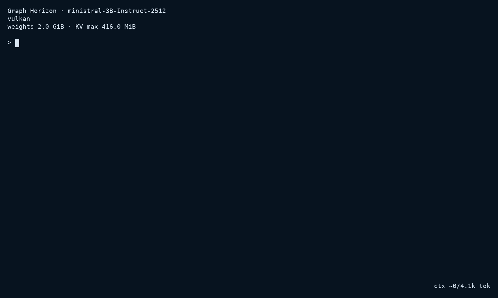
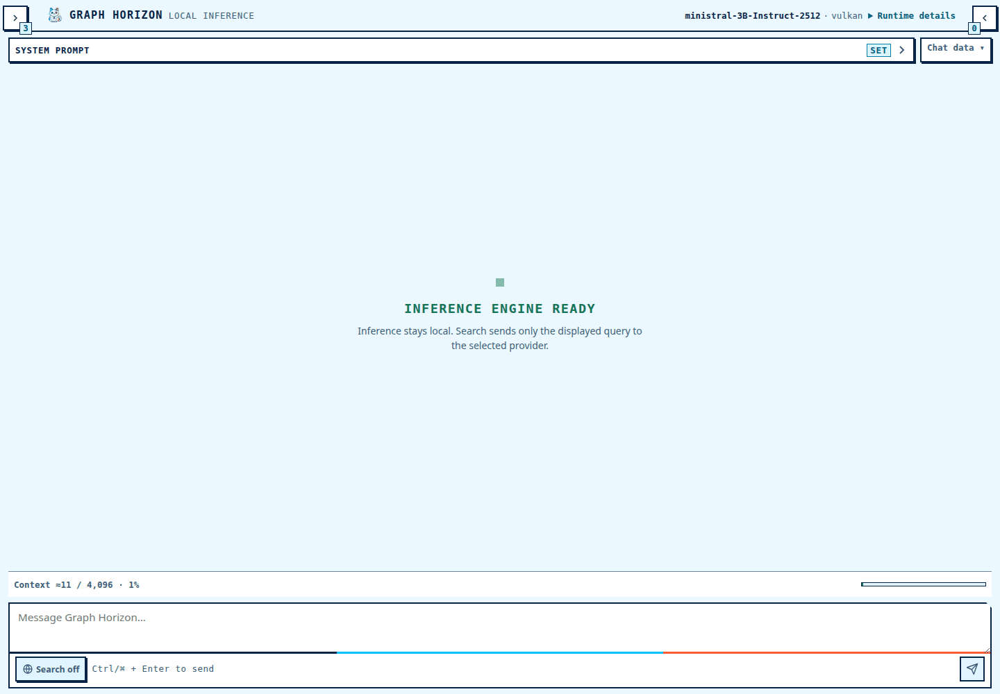

<!--
This README owns the shortest supported path from discovering Graph Horizon to
installing and running it. Detailed contracts and evidence belong to the linked
documentation.
-->

<p align="center">
  
</p>

# Graph Horizon

[](https://github.com/etufarini/graph-horizon/actions/workflows/ci.yml)

Graph Horizon is a focused local Rust runtime for Ministral 3 GGUF inference
across CPU, Vulkan, Metal, and CUDA, with hybrid CPU/accelerator placement for
Vulkan, Metal, and CUDA and built-in terminal and Web interfaces. It supports
the Instruct and Reasoning 2512 models in the 3B, 8B, and 14B sizes.

The Web UI can optionally send one explicit Web or News query to a public
provider. Graph Horizon has no standalone server mode or supported public HTTP
API.

## Interfaces

### Command line



### Web UI



## Why Graph Horizon?

Graph Horizon is intentionally focused: it provides a small, inspectable Rust
runtime for local Ministral 3 inference instead of a broad model ecosystem.

- Explicit CPU, Vulkan, Metal, CUDA, and hybrid execution profiles.
- Local terminal and Web interfaces in one self-contained application.
- Strict GGUF validation with no silent backend or model fallback.
- Reproducible qualification and performance evidence.
- Local inference, conversation history, and file persistence by default.

Graph Horizon is not a drop-in replacement for llama.cpp. Choose it when a
narrow, auditable Ministral runtime is more valuable than broad model and
platform coverage.

## Quick Install

### Prepared v0.1.5 release

After the exact `v0.1.5` candidate is published, the commands below build Graph
Horizon from its authenticated source release and install it in
`$HOME/.local/bin` by default. They are prepared release commands, not evidence
that publication has occurred. Review the complete
[prerequisites and installation options](docs/installation.md) before running it.

On Apple Silicon macOS with the Xcode command-line Metal tools:

```sh
curl --fail --location --silent --show-error \
  https://raw.githubusercontent.com/etufarini/graph-horizon/v0.1.5/install.sh \
  | bash -s -- --backend metal
```

On Linux `x86_64` with a working Vulkan loader and driver:

```sh
curl --fail --location --silent --show-error \
  https://raw.githubusercontent.com/etufarini/graph-horizon/v0.1.5/install.sh \
  | bash -s -- --backend vulkan
```

On Linux `x86_64` with an NVIDIA driver and CUDA Toolkit `nvcc`:

```sh
curl --fail --location --silent --show-error \
  https://raw.githubusercontent.com/etufarini/graph-horizon/v0.1.5/install.sh \
  | bash -s -- --backend cuda
```

For automatic CPU/accelerator placement, install the matching hybrid profile.
On Apple Silicon macOS with the Xcode command-line Metal tools:

```sh
curl --fail --location --silent --show-error \
  https://raw.githubusercontent.com/etufarini/graph-horizon/v0.1.5/install.sh \
  | bash -s -- --backend metal-hybrid
```

On Linux `x86_64` with a working Vulkan loader and driver:

```sh
curl --fail --location --silent --show-error \
  https://raw.githubusercontent.com/etufarini/graph-horizon/v0.1.5/install.sh \
  | bash -s -- --backend vulkan-hybrid
```

On Linux `x86_64` with an NVIDIA driver and CUDA Toolkit `nvcc`:

```sh
curl --fail --location --silent --show-error \
  https://raw.githubusercontent.com/etufarini/graph-horizon/v0.1.5/install.sh \
  | bash -s -- --backend cuda-hybrid
```

Quick install selects one compile-time profile. Automatic placement occurs
later when a model loads and can be constrained with the existing runtime
placement flags. Prefix-KV reuse is unavailable for every hybrid profile.

Use `--backend cpu` instead when GPU execution is not required. If the command
is not found after installation, add the default binary directory to the
current shell:

```sh
export PATH="$HOME/.local/bin:$PATH"
```

### CUDA qualification boundary

The installer accepts `cuda` and `cuda-hybrid` only on Linux `x86_64` and
requires `nvcc` before it builds any project asset. Both use visible device
ordinal 0 and the existing capability floor. `cuda-hybrid` composes the CPU and
CUDA numeric backends; it adds no numeric backend or kernel. Its immutable plan
uses separate RAM and VRAM, with all-GPU, mixed, and CPU-only modes. Mixed
execution performs one synchronous CPU-to-CUDA residual crossing per pass.

Neither CUDA profile supports prefix-KV reuse. The **qualified**
`cuda-hybrid` claim is limited to the six recorded 3B Instruct, context-4096,
f16/int8 placement rows at the exact implementation commit in
[validation evidence](docs/project-status/validation-evidence.md#cuda-hybrid-implementation-gate--3-september-2026).
This is not a production or performance claim. Neighboring devices, software,
artifacts, model sizes, contexts, and KV schemes remain unclaimed; see the
[backend status](docs/engine/backend-support-status.md) for the exact boundary.

## Stable Release And Main

The current published stable release is `v0.1.4`, frozen by an immutable
annotated tag. Its release claims and validation evidence apply only to that
exact tagged commit. `v0.1.5` remains a source candidate until its exact final
commit, annotated tag, archive, and checksum are published and verified. `main`
contains ongoing development, may be ahead of the stable tag, and is not
automatically release-qualified.

The prepared `v0.1.5` commands deliberately use the future immutable tag
instead of `main`. See the
[release notes](docs/project-status/release-notes.md) and
[exact validation evidence](docs/project-status/validation-evidence.md) for the
scope and identity of published claims.

## Models

Download the `Q4_K_M` GGUF file from one of the supported repositories:

| Size | Instruct | Reasoning |
|---|---|---|
| 3B | [Ministral 3 3B Instruct](https://huggingface.co/unsloth/Ministral-3-3B-Instruct-2512-GGUF) | [Ministral 3 3B Reasoning](https://huggingface.co/unsloth/Ministral-3-3B-Reasoning-2512-GGUF) |
| 8B | [Ministral 3 8B Instruct](https://huggingface.co/unsloth/Ministral-3-8B-Instruct-2512-GGUF) | [Ministral 3 8B Reasoning](https://huggingface.co/unsloth/Ministral-3-8B-Reasoning-2512-GGUF) |
| 14B | [Ministral 3 14B Instruct](https://huggingface.co/unsloth/Ministral-3-14B-Instruct-2512-GGUF) | [Ministral 3 14B Reasoning](https://huggingface.co/unsloth/Ministral-3-14B-Reasoning-2512-GGUF) |

Other quantizations are not supported. See
[supported models and formats](docs/supported-models-and-formats.md) for the
complete public contract and artifact-validation boundary.

## CLI

Start a conversation in the terminal; `cli` is the default mode:

```sh
graph-horizon --model "/absolute/path/to/model.gguf"
```

Start the integrated Web UI, then open
[http://127.0.0.1:8080](http://127.0.0.1:8080):

```sh
graph-horizon --mode web --model "/absolute/path/to/model.gguf"
```

Inspect the complete runtime option list or installed version:

```sh
graph-horizon --help
graph-horizon --version
```

The interactive terminal recognizes these local commands:

| Command | Effect |
|---|---|
| `/clear` | Clear the current conversation |
| `/system <text>` | Replace the system prompt |
| `/export [path]` | Save the conversation as JSON |
| `/import <path>` | Restore a conversation from JSON |

See the [runtime option reference](docs/command-line/runtime-options.md) and
[slash-command guide](docs/command-line/slash-commands-and-file-attachments.md)
for all options and behavior.

## Documentation

- [Complete documentation index](docs/README.md)
- [Installation](docs/installation.md) and [support](SUPPORT.md)
- [Command-line interface](docs/command-line/README.md) and [runtime options](docs/command-line/runtime-options.md)
- [Local Web interface](docs/web-interface/README.md)
- [Supported models and formats](docs/supported-models-and-formats.md)
- [Architecture](docs/engine/architecture.md) and [backend support status](docs/engine/backend-support-status.md)
- [Validation evidence](docs/project-status/validation-evidence.md) and [release notes](docs/project-status/release-notes.md)
- [Engine library](crates/graph_horizon_engine/README.md)
- [Contributing](CONTRIBUTING.md)
- [Security policy](SECURITY.md)
- [License](LICENSE)
